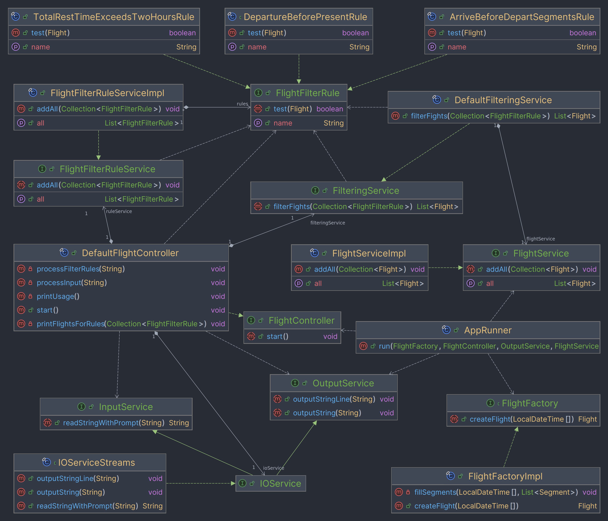

# Модуль Flight Filter

## Описание
Flight Filter — это модуль, который позволяет проводить фильтрацию набора перелетов согласно правилам. Различные комбинации правил могут применяться к набору перелетов динамически во время работы приложения. Особый акцент делался на легкости масштабирования, простоте модульного тестирования, низкой степень связанности компонентов модуля.

## Структура модуля



## Функционал
- Консольный вывод наборов перелетов;
- Применение одного, или нескольких правил фильтрации для набора перелетов:
  - вылет до текущего момента времени;
  - имеются сегменты с датой прилёта раньше даты вылета;
  - общее время, проведённое на земле превышает два часа.
- Возможность добавления новых правил без изменения структуры модуля;
- Возможность добавления источника данных (файл, БД) без существенных изменений структуры модуля.

### Предварительные требования
- Java 17+
- Maven 3.8.2+

## Запуск
1. Клонировать репозиторий:
    ```sh
    git clone https://github.com/0nePrv/flight-filter
    ```
2. Перейти в директорию проекта:
    ```sh
    cd flight-filter
    ```
3. Собрать проект:
    ```sh
    mvn clean package
    ```
4. Запустить приложение:
    ```sh
    java -jar target/flights-filter-1.0.1.jar
    ```

## Тестирование
### Покрытие тестами:

### Запуск тестов:
```sh
mvn test
```
